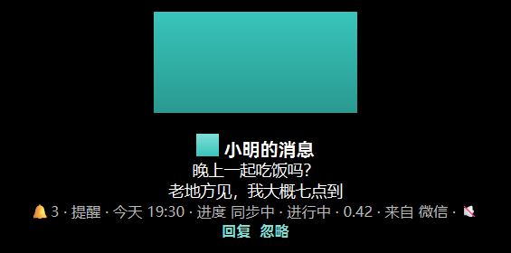

# XHT 通知：按 Windows Toast 的内容元素显示与激活

## 需求

> 小黑条（XHT）的通知提示要按 **Windows Toast 消息的内容元素**显示，而不是只把
> 通知当成「标题 + 正文 + 其它文本」；通知里的按钮要能点，并且点的效果要真的送到
> 发出通知的那个应用。

原来的实现（`features/XHT/Lib/Notify.py` 的早期版本）只把所有 `<text>` 拉平成一个
数组，用 `texts[0]` 当标题、`texts[1]` 当正文、`texts[2:]` 当「其他信息」。这有几处
必然出错的地方：

| 现象 | 原因 |
| ---- | ---- |
| 「来自 某某应用」这类归属文本被当成正文行，夹在正文中间 | `<text placement="attribution">` 是独立角色 |
| 旧模板（`ToastText02`）里正文跑到标题位置 | 旧模板靠 `<text id="1">` 区分角色，不靠文档顺序 |
| 图片（应用图标 / 横幅图）、进度条、提醒/闹钟/来电场景完全看不到 | 它们根本不是 `<text>` |
| 通知里的「回复 / 打开 / 忽略」按钮无所指 | 按钮是 `<action>`，且点击语义是**激活**，不是超链接 |

## 内容元素一览

解析实现在 `features/catch_notify/toast.py`，模型与显示方式的对应关系：

| Toast 内容元素 | 模型 | 小黑条上的表现 |
| -------------- | ---- | -------------- |
| `<text>` 第一条（`role=title`） | `ToastText` | 16px 加粗 |
| `<text>` 其余（`role=body`） | `ToastText` | 14px 常规，一行一条 |
| `<text placement="attribution">` | `ToastText(role=attribution)` | 13px 弱化，跟在正文后面 |
| 旧模板 `<text id="1">` / `id="2..4"` | 同上（按 `id` 定角色） | 同上 |
| `<image placement="appLogoOverride">` | `ToastImage` | 标题前内联 20px（`hint-crop` 目前只记录） |
| `<image placement="hero">` | `ToastImage` | 顶部横幅，等比缩到 320×90 以内 |
| `<image>`（内联）/ 网络图片 / 包内资源 | `ToastImage` | 不显示，只进 tooltip |
| `<progress>` | `ToastProgress` | `进度 下载 · 进行中 · 40%` |
| `<header>` | `ToastHeader` | `提醒 · 今天 20:00` |
| `<toast scenario="reminder|alarm|incomingCall">` | `ToastContent.scenario` | 场景标签（提醒 / 闹钟 / 来电） |
| `<action>`（按钮） | `ToastAction` | 可点击的链接（`回复`），点击即激活 |
| `<action placement="contextMenu">` | `ToastAction` | 只进 tooltip（不占版面） |
| `<input type="text|selection">` | `ToastInput` / `ToastChoice` | 点击按钮时弹输入框收集内容 |
| `<audio silent="true">` | `ToastAudio` | `🔇` |
| `<toast launch/duration/activationType/displayTimestamp>` | `ToastContent` 属性 | tooltip |

`Notification.content` 是这些元素的入口（惰性解析 + 缓存，见
`features/catch_notify/records.py`）。旧的 `title` / `body` / `other_texts` / `texts`
接口仍然可用，只是现在**优先按角色取**，取不到才退回原来的位置约定 —— 所以
`catch_notify` 的既有调用方和 CLI 不用改。

## 解析器为什么自己写

项目的 cx_Freeze 配置把 `xml` 放进了 `EXCLUDES`（见 `build.py`），所以
`toast.py` 自带一个极小的字符串扫描器：只识别元素、属性、文本，不校验文档。它刻意
**宽容** —— 通知 XML 来自第三方应用，标签没闭合、属性没引号、混着 CDATA 都不能让
显示层报错：

* 标签没闭合 → 剩下的内容按文本收下，不丢内容；
* 属性值单双引号都认，`>` 出现在引号里也不会把标签截断；
* `<!-- -->`、`<?xml ?>`、`<!DOCTYPE>`、`<![CDATA[]]>` 都能跳过；
* `Payload` 是字节时按 UTF-8 / UTF-16 BOM / GBK 依次试（`decode_payload`）；
* 整个文档不是 XML（纯垃圾）也只会得到空内容对象，不会抛异常。

解析失败/可疑的地方记在 `ToastContent.parse_errors` 里，CLI 会打出来。

### 角色判定规则

```
placement="attribution"           → attribution（归属，永远不占正文位）
旧模板（template 不是 ToastGeneric）且带 id：
    id="1"                        → title
    其它 id                       → body
其余情况（ToastGeneric 等）：文档顺序里第一条非归属文本 → title，其余 → body
```

多个 `<binding>`（同一通知的多语言 / 多布局备选）时：优先 `ToastGeneric`，否则第一个
带文本的 binding 作为**主 binding**（`texts` / `images` / `progress` 来自它），
`all_texts` 保留全部文本，`extract_texts()` 的旧行为（文档顺序取所有 `<text>`）不变。

## 显示层



（上图由 `python tests/manual_toast_render.py` 离屏渲染生成，可以自己改样例再生成。）

`NotificationBadge.show_content(content, unread, app_name, …)` 按上表排版；样式常量
（字号 / 字重 / 按钮色）在 `features/XHT/Lib/Notify.py` 顶部，按钮用品牌色
`#80E0D7`（配色见 `杂物/1.md`）。

几个刻意的取舍：

* **只有本机可读的图片才显示**。`local_image_path()` 支持 `file:///…`、本地绝对路径、
  UNC、以及带包族名时的 `ms-appdata:///local/…`；网络图片（QLabel 不会去下载）和
  `ms-appx:///` 包内资源一律不显示，只进 tooltip。尺寸先用 `QImageReader` 量出来再
  等比缩放，读不出来（文件没了 / 不是图片）就当没有。
* **按钮是富文本链接**（`<a href="xht-action:N">`），点它发
  `actionTriggered(N)`；点其它地方发 `clicked`（标记已读 / 可选激活通知本体）。
  PySide6 没有绑定 `QLabel::anchorAt`，所以用「`super().mouseReleaseEvent()` 里会
  同步触发 `linkActivated`」这个事实来区分两类点击：先跑父类实现，链接被点过就
  只派发动作，否则才派发 `clicked`。
* **上下文菜单按钮不占版面**，只出现在 tooltip 里。
* 场景标签和 header 标题常常是同一个词（都叫「提醒」），弱化行会去重。
* 激活结果（`✓ 已发送「回复」` / `⚠ …`）会在小黑条上停留 3 秒
  （`FEEDBACK_MS`），随后自动收起。

### 配置项（`settings.json` → `xht`）

| 键 | 默认 | 含义 |
| -- | ---- | ---- |
| `notify_actions` | `true` | 是否显示可点击的通知按钮 |
| `notify_images` | `true` | 是否显示应用图标 / 横幅图 |
| `notify_click_activates` | `false` | 点击内容本体时是否同时激活应用（默认关：点击在本项目里一直是「标记已读」） |

设置界面在 **XHT** 页里，保存后即时生效（`XHTWindow.RefreshConfig()` →
`NotificationPresenter.apply_config()`）。

## 激活：把点击送回应用

这是本功能里唯一需要和「别人的进程」打交道的部分，实现在
`features/catch_notify/activation.py`。

### 为什么不是超链接

Windows 的 Toast 按钮语义是**激活请求**：通知里写着
`<action content="回复" arguments="action=reply" hint-inputId="reply"/>`，系统在点击时
调用该应用注册的 COM 回调：

```c
HRESULT INotificationActivationCallback::Activate(
    LPCWSTR appUserModelId, LPCWSTR invokedArgs,
    const NOTIFICATION_USER_INPUT_DATA *data, ULONG count);
```

XHT 只是通知的旁观者，要让按钮真的生效，就得替系统走完这一步。

### 通道一：应用注册的 COM 激活器（精确送达）

1. 取 AUMID（数据库源是 `NotificationHandler.PrimaryId`，WinRT 源是 `AppInfo.AppUserModelId`）；
2. `HKCU\Software\Classes\AppUserModelId\<AUMID>` → `CustomActivator` = CLSID
   （AUMID 在注册表里可能换个斜杠方向或大小写，`aumid_candidates()` 会把变体都试一遍；
   HKCU 找不到再查 HKLM）；
3. `CoCreateInstance(CLSID, IID_INotificationActivationCallback)` —— 注册表里
   `…\CLSID\{…}\LocalServer32` 指向应用自己的 exe，COM 会带着 `-Embedding` 把它拉起来；
4. 按 vtable **slot 3** 调用 `Activate(aumid, arguments, inputs, count)`。

`INotificationActivationCallback` 没有 typelib / IDispatch，所以走不了
`win32com.client`；而 pywin32 的 `pythoncom.CoCreateInstance` 虽然能拿到
`PyIUnknown`，却**交不出底层接口指针**（没有 `__int__`，也不能直接给 ctypes），
因此调用走 `ctypes`：`ole32.CoCreateInstance` 拿到指针后直接按 vtable 下标调函数，
参数用 `NOTIFICATION_USER_INPUT_DATA { LPCWSTR Key; LPCWSTR Value; }` 数组封送。
系统为该接口注册了 proxy/stub（`HKCR\Interface\{53E31837-…}\ProxyStubClsid32`），
所以**跨进程**（LocalServer32）也能正确封送。

`CoCreateInstance` 可能在等应用的后台进程，所以 `perform()` 要在工作线程里调
（XHT 显示层就是新起一个短命线程）；本模块自己负责每个线程的 `CoInitializeEx`。

### 通道二 / 三：其他内容元素对应的降级

`build_plan()` 是纯函数，只产出「打算怎么做」（可以直接断言）；`perform()` 才真的
执行，且执行者都可以注入替身：

| 情况 | 策略 | 行为 |
| ---- | ---- | ---- |
| `arguments="dismiss"` 等系统动作 | `dismiss` | 把通知从通知中心移除（尽力而为） |
| `activationType="protocol"` | `protocol` | `ShellExecuteW(arguments)`，例如 `ms-settings:`、`https://…` |
| 应用注册了 `CustomActivator` | `com` | 通道一，参数原样送达 |
| 打包应用（UWP / MSIX）没有激活器 | `activate-application` | `IApplicationActivationManager::ActivateApplication(aumid, arguments)` 按 AUMID 拉起应用并把 arguments 交给它 |
| `ActivateApplication` 也失败 | `shell-apps-folder` | `explorer.exe shell:AppsFolder\<AUMID>`，至少把应用带到前台 |
| `activationType="background"` 且没有激活器 | `unsupported` | 明确报告「后台动作需要应用注册 COM 激活器」 |

后三种都不是「精确送达」：`ActivationPlan.exact` 为 `False` 时，小黑条的反馈会是
「已尽力交给应用」而不是「已发送」。**不假装成功**比「看起来能用」更重要。

### 输入框

点击按钮时，`ToastContent.action_inputs(action)` 决定要问哪些输入：有
`hint-inputId` 就只要那一个，没有就是通知里的**全部**输入框（与 Windows 一致）；
系统动作与协议动作不带输入。文本输入用 `QInputDialog.getText`，下拉输入
（`<input type="selection">`）用 `QInputDialog.getItem`，用户取消就什么都不发。

### 移除通知中心里的那条

`dismiss_from_history()` 依次尝试三条通道并如实报告失败原因：

1. `UserNotificationListener.RemoveNotification(id)`（需要「访问通知」授权）；
2. `ToastNotificationHistory.Remove(tag, group, aumid)`（要求调用方有包标识，
   普通桌面进程常见结果是 `0x80073D54`）；
3. 桥接 exe 的 `remove` 子命令（`native/NotificationBridge.cs`，需要重新编译
   `NotificationBridge.exe` 才有）。

三条都失败很正常：移除只是「点了忽略就把通知中心里那条也收掉」的锦上添花，失败
只影响提示文案，不影响按钮本身的激活。小黑条自己的未读状态与它无关。

## 测试与手工验证

```bash
python tests/test_toast_content.py      # 解析 / 激活 / 渲染的回归测试（含自造 vtable 的封送验证）
python -m features.catch_notify.selftest  # 库自检（内容元素部分 + 通知库端到端）
python tests/manual_toast_activate.py   # 只读：看真实通知的内容元素与激活计划
python tests/manual_toast_activate.py --activate 0 --plan-only
python tests/manual_toast_activate.py --activate 0 --input reply=好的 --yes
python tests/manual_toast_render.py     # 离屏渲染一张示例通知（docs/toast_content_demo.png）
python -m features.catch_notify --once --activate 0 --plan-only
```

`--plan-only` 只用 `build_plan()`，不会碰任何应用；去掉它才会真的调
`CoCreateInstance` / `ShellExecute`。

## 已知限制

* **打包应用按钮的精确送达**：UWP / MSIX 应用不登记 `CustomActivator`，我们只能
  按 AUMID 拉起并交给它 arguments；如果应用不解析这些参数，动作就只是「打开了应用」。
  反馈文案会说明这是尽力送达。
* **后台动作**（`activationType="background"`）没有激活器时不做任何事，只报告原因 ——
  把「暂停下载」当成「打开应用」是误导。
* **移除通知中心里的那条**不可靠（见上）。
* **网络图片 / 包内资源图片**不显示（QLabel 不会去下载；包内资源要查包安装位置）。
* **多 binding** 只显示主 binding 的内容，其它 binding 的文本只进 tooltip。
* `hint-crop="circle"`（圆形应用图标）目前只记录，不做圆形裁剪。
* `<input type="date|time">` 按普通文本框处理（没有日历控件）。

## 涉及的文件

```
features/catch_notify/toast.py        Toast 内容元素解析（宽容扫描器 + 模型）
features/catch_notify/activation.py   激活链路（注册表 / ctypes COM / 降级 / 移除）
features/catch_notify/records.py      Notification.content 与角色化 title/body
features/catch_notify/cli.py          内容元素呈现 + --activate / --plan-only
features/catch_notify/selftest.py     内容元素自检
features/catch_notify/native/         C# 桥接程序（新增 remove 子命令）
features/XHT/Lib/Notify.py            按内容元素渲染 + 点击 → 激活 → 反馈
core/settings.py                      设置界面（按钮 / 图片 / 点击激活）
core/config_manager.py                默认配置
tests/test_toast_content.py           回归测试
tests/manual_toast_activate.py        手工验证（默认只读）
```
